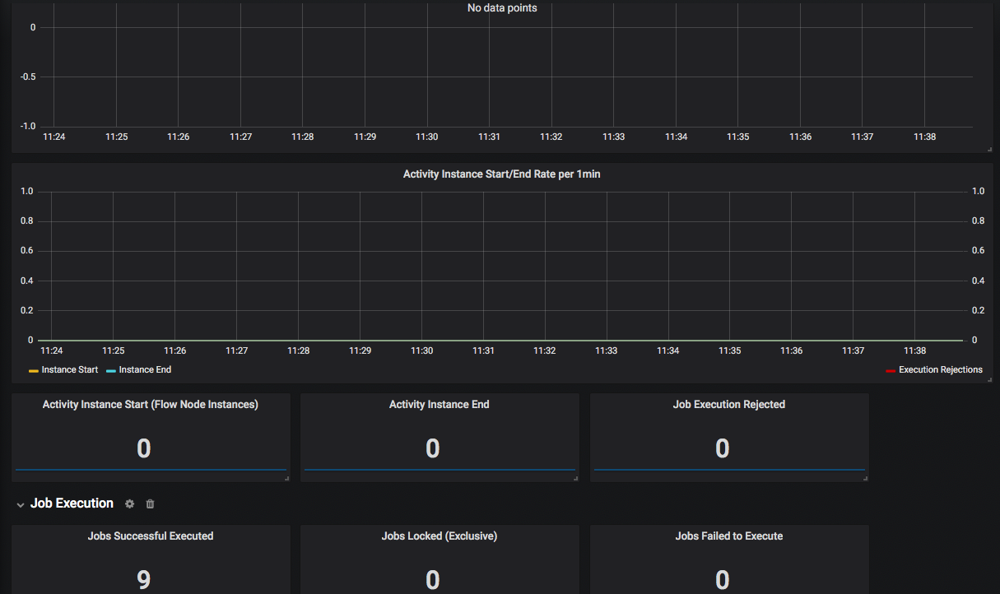
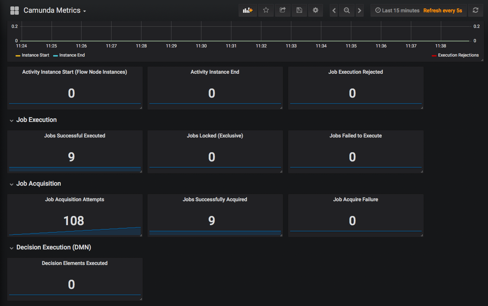
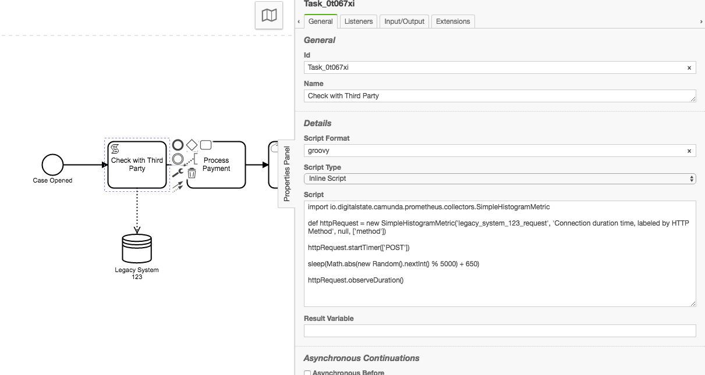
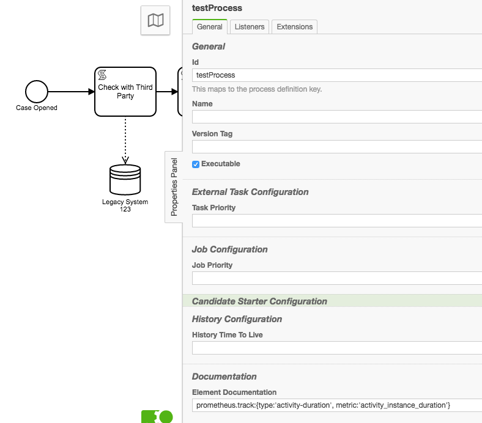
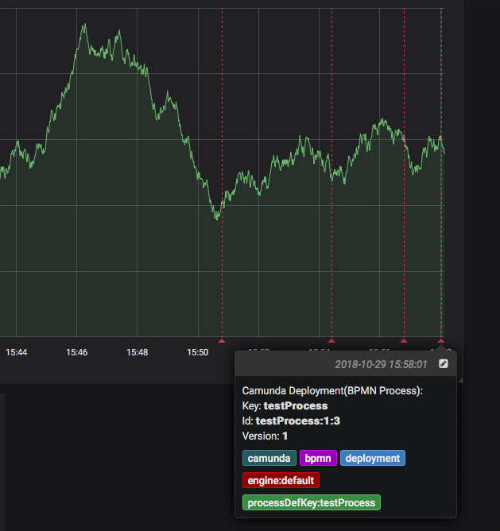

# Camunda BPM Prometheus Process Engine Plugin

Camunda Process Engine Plugin that implements a Prometheus Client HTTP Server, Collectors for the Camunda Metric 
system, and a Groovy based custom collector system allowing yml based configuration of custom collectors that are based on groovy scripts.


----

# How to Install Plugin into Camunda

# As a Jar:

See the usage in `./docker/Dockerfile`

# As a dependency

Add JitPack as a repository source in your build file.

If you are using Maven, then add the following to your pom.xml

```xml
<project>
...
    <repositories>
        <repository>
            <id>jitpack.io</id>
            <url>https://jitpack.io</url>
        </repository>
    </repositories>
...
```

This snippet will enable Maven dependency download directly from Github.com

Then add the following dependency:

```xml
...
 <dependency>
    <groupId>com.github.digitalstate</groupId>
    <artifactId>camunda-prometheus-process-engine-plugin</artifactId>
    <version>v0.0.0-Replace-This-With-Real-Version</version>
    <scope>compile</scope>
 </dependency>
 ...
```
:exclamation: See the [Releases](https://github.com/StephenOTT/camunda-prometheus-process-engine-plugin/releases) for the latest version number :exclamation:


# Plugin Configuration

```xml
<!-- engine plugins -->
<property name="processEnginePlugins">
    <list>
        ...
            <bean id="prometheusPlugin" class="io.digitalstate.camunda.prometheus.PrometheusProcessEnginePlugin">
                 <property name="port" value="9999" />
                 <property name="camundaReportingIntervalInSeconds" value="5"/>
                 <property name="collectorYmlFilePath" value="/camunda-prometheus/prometheus-metrics.yml"</property>
            </bean>
        ...
    </list>
</property>
```

The port is the port that the HTTP Server that Prometheus will use to access the metrics.


# YAML Collector Configuration

Each collector is configured through a single yaml file.  the Yaml file is set in the PLugins xml configuation such as:

```xml
<bean id="prometheusPlugin" class="io.digitalstate.camunda.prometheus.PrometheusProcessEnginePlugin">
    ...
     <property name="collectorYmlFilePath" value="/camunda-prometheus/prometheus-metrics.yml"</property>
</bean>
```

## System Collectors

The System collectors use the following configuration

```yaml
system:
- collector: io.digitalstate.camunda.prometheus.collectors.camunda.BpmnExecution
  enable: true
  startDate: 2015-10-03T17:59:38+00:00
  endDate: now
  startDelay: 0
  frequency: 5000
```

Where:

1. `collector` (class name) is the fully qualified java class name of the collector.  The default Camunda metrics are implemented in the following classes: `io.digitalstate.camunda.prometheus.collectors.camunda.BpmnExecution`, `io.digitalstate.camunda.prometheus.collectors.camunda.DmnExecution`, `io.digitalstate.camunda.prometheus.collectors.camunda.JobExecutor`.
1. `enable` (boolean) allows you to enable and disable the collector.
1. `startDate` (ISO8601 String Date Format) start date that the metrics should be queried from using the Camunda metrics java api.
1. `endDate` (ISO8601 String Date Format, and special keyword  of `now`) end date that the metrics should be queried from using the Camunda metrics java api.  The end date allows the special keyword of `now` which tells the engine to always return the most recent data.
1. `startDelay` (long) the amount of time in milliseconds that the collector delay it self from starting on the first startup.  This is useful if you have other plugins or systems that you want to wait to finish starting before you execute the collector for the first time.
1. `frequency` (long) the amount of time in milliseconds between executions of the collector.


## Custom Collectors

The Custom collectors use the following configuration

```yaml
custom:
- collector: /customcollectors/UserTasks.groovy
  enable: true
  startDelay: 0
  frequency: 5000
```

```yaml
custom:
- collector: classpath:/prometheus/customcollectors/IncidentMetrics.groovy
  enable: true
  startDelay: 0
  frequency: 5000
```

Where:

1. `collector` (string, file path) is the file path to the groovy script file which will be used for collector execution.  The script is pre-compiled on timer creation; if changes are made to the groovy during runtime, the engine will need to be restarted for changes to come into effect.  If the path is prepended with `classpath:` then the collector location will assume a classpath path to the resource.
1. `enable` (boolean) allows you to enable and disable the collector.
1. `startDelay` (long) the amount of time in milliseconds that the collector delay it self from starting on the first startup.  This is useful if you have other plugins or systems that you want to wait to finish starting before you execute the collector for the first time.
1. `frequency` (long) the amount of time in milliseconds between executions of the collector.
1. `config` (object/map) (:exclamation: **EXPERIMENTAL**) a key/value (`<String, Object>`) map for storing custom configurations to be used in the script execution.  Config can be accessed in the groovy script execution using the `config.getConfig()` method, where `config` is the CustomMetricsConfig.class which is being exposed to the script through bindings, and `.getConfig()` is returning the map in the `config` property of the collector.   


## Default Custom Collectors

A series of custom collectors are included.
See: `./src/main/resources/prometheus/customcollectors`  

## Full Example

```yaml
# Camunda Prometheus Metrics configuration
# each object is a timer configuration
---
system:
- collector: io.digitalstate.camunda.prometheus.collectors.camunda.BpmnExecution
  enable: true
  startDate: 2015-10-03T17:59:38+00:00
  endDate: now
  startDelay: 0
  frequency: 5000
- collector: io.digitalstate.camunda.prometheus.collectors.camunda.DmnExecution
  enable: true
  startDate: 2015-10-03T17:59:38+00:00
  endDate: now
  startDelay: 0
  frequency: 5000
- collector: io.digitalstate.camunda.prometheus.collectors.camunda.JobExecutor
  enable: true
  startDate: 2015-10-03T17:59:38+00:00
  endDate: now
  startDelay: 0
  frequency: 5000

custom:
- collector: /customcollectors/UserTasks.groovy
  enable: true
  startDelay: 0
  frequency: 5000
- collector: /customcollectors/BpmnProcessDefinition.groovy
  enable: true
  startDelay: 0
  frequency: 5000
- collector: /customcollectors/EventsMetrics.groovy
  enable: true
  startDelay: 0
  frequency: 5000
- collector: classpath:/customcollectors/IdentityServiceMetrics.groovy
  enable: true
  startDelay: 0
  frequency: 5000
- collector: classpath:/customcollectors/IncidentMetrics.groovy
  enable: true
  startDelay: 0
  frequency: 5000
- collector: /customcollectors/ProcessInstances.groovy
  enable: true
  startDelay: 0
  frequency: 5000
- collector: /customcollectors/TimerMetrics.groovy
  enable: true
  startDelay: 0
  frequency: 5000
```


# Prometheus and Camunda Deployment/Setup:

1. Prometheus/Grafana Setup: `./docker/prometheus-grafana` : run `USERNAME=admin PASSWORD=admin docker-compose up`
1. Camunda 7.9.0 Setup: `./docker` : run `docker-compose up`

Prometheus will attempt to scape the Camunda metrics through the exposed endpoint from the plugin.

Make sure that Camunda and Prometheus are part of the same network / Prometheus is able to access the  metrics 
http endpoint being exposed on the Camunda server.

See the examples in the ./docker folder of this project.


# Default Grafana Configuration

A default Grafana dashboard with common queries is provided:

See folder: `./grafana/dashboards`

1. Current working template for Generic Metrics: `Camunda Metrics-1.json`
1. Current working template for Process and Activity Duration Tracking: `Camunda Duration Tracking-1.json`

----

# Custom Metrics as Groovy Scripts

## Bindings (Variables exposed in the script)

The scripts execute without any class restrictions, and provide the following bindings for easy access:
1. `config` (package io.digitalstate.camunda.prometheus.config.yaml.CustomMetricsConfig) the CustomMetricsConfig object containing all data from the yaml config of the specific collector.
1. `processEngine` (org.camunda.bpm.engine.ProcessEngine) contains the process engine object allowing full access to process engine services.
1. `LOGGER` (org.slf4j.Logger) a logger to be specifically used by script executions.  Implemented as: `LoggerFactory.getLogger("CamundaCustomMetrics-ScriptLOGGER");`

# Performance considerations

Take into consideration the execution times of your metric collectors.  Each metric collector is 
run as a standalone timer thread execution, but the more collectors you add, and the large the 
data processing and/or database query time/load the collector uses per execution, it can create 
large performance impacts on the engine.

----

# Generic Metrics Classes

Simple but reusable metrics are provided for ease of use by BPMN process builders.

1. SimpleGaugeMetric (io.digitalstate.camunda.prometheus.collectors.SimpleGaugeMetric)
1. SimpleCounterMetric (io.digitalstate.camunda.prometheus.collectors.SimpleCounterMetric)
1. SimpleHistogramMetric (io.digitalstate.camunda.prometheus.collectors.SimpleHistorgramMetric)
1. SimpleSummaryMetric (io.digitalstate.camunda.prometheus.collectors.SimpleSummaryMetric)

See the Test folder for further usage, and see the metric classes.  
They are generally simplifications over the existing metrics API.  They are designed to remove "extras" and simplify usage.

# Namspace

the `camunda` namespace is given to all metrics generated by the Simple Metric classes.

# Prometheus Collector Registry

The Default registry is used.

# Labels

Labels are supported and are generally implemented as a optional parameter in the method.  See examples above.

----

# Further screenshots





----

# Script examples for BPMN, DMN, CMMN execution: Creating and using Metric within the BPM execution
 
 
 
 
 
 
 **Groovy script Examples:**

```groovy
import io.digitalstate.camunda.prometheus.collectors.SimpleGaugeMetric;

def openCases = new SimpleGaugeMetric('open_cases', 'Number of Open Cases, labeled by Case Type', ['type'])

openCases.increment(['standard'])
```

```groovy
import io.digitalstate.camunda.prometheus.collectors.SimpleHistogramMetric

def httpRequest = new SimpleHistogramMetric('legacy_system_123_request', 'Connection duration time, labeled by HTTP Method', null, ['method'])

httpRequest.startTimer(['POST'])

sleep(Math.abs(new Random().nextInt() % 5000) + 650) // Simulates a delay

httpRequest.observeDuration()

```

```groovy
import io.digitalstate.camunda.prometheus.collectors.SimpleGaugeMetric

def money = new SimpleGaugeMetric('money_collected', 'dollar values collected, labeled by form of payment', ['payment_form'])

def amount = Math.abs(new Random().nextDouble() % 284.03) + 23.54 // Random dollar value
money.increment(amount, ['credit-card'])
```

```groovy
import io.digitalstate.camunda.prometheus.collectors.SimpleGaugeMetric

def openCases = new SimpleGaugeMetric('open_cases')

openCases.decrement(['standard'])

def closedCases = new SimpleGaugeMetric('closed_cases', 'Number of Open Cases, labeled by Case Type', ['type'])
closedCases.increment(['standard'])
```

----

# Default Metrics

Notes:

1. All default metrics are configured through the plugin properties of `pollingFrequencyMills` and `pollingStartDelayMills`.
1. All default metrics use a `engine_name` label which is used to identity the unique engine collecting the metrics.

There is two default metrics that are loaded:

## Camunda Engine Metrics (Default metric system/queries provided by Camunda):

All custom metrics as defined in the Camunda Metrics documentation are implemented:

LINK to Camunda Metrics Docs are located here.

Metric names follow the pattern of:

`metric_[metric name using underscores]`

Example:  Using the Camunda metric `activity-instance-start`, the metric would be created as 
`metric_activity_instance_start`, and would appear in Prometheus / Grafana as `camunda_metric_activity_instance_start`, 
where the `camunda_` is the namespace of the metric

----

# Reusable Collector Groovy Scripts

Reusable/configurable groovy scripts are provided within the classpath of the jar for common usage cases:

You can use these scripts in production, or as a basis for your own re-usable script for a different metric within the engine.

## External Tasks

Tracking external tasks can be configured for "per-workerId" and "per-topicName":

```yaml
custom:
- collector: classpath:prometheus/customcollectors/ExternalTasksCustomTopics.groovy
  enable: true
  startDelay: 0
  frequency: 10000
  config:
    topics:
    - myTopic1
    - myTopic2
    - someCustomTopic
- collector: classpath:prometheus/customcollectors/ExternalTasksCustomTopics.groovy
  enable: true
  startDelay: 0
  frequency: 8000
  config:
    topics:
    - myTopic3
    - myTopic4
    - someOtherCustomTopic
- collector: classpath:prometheus/customcollectors/ExternalTasksCustomWorkers.groovy
  enable: true
  startDelay: 0
  frequency: 2000
  config:
    workers:
    - someWorkerID123
    - someOtherWorkerId567890
    - someLegacyWorker001
``` 

Take note of the following:

1. The use of the `config` property allowing you to define a array of `topics` or `workers`.
1. The same collector .groovy file is used multiple times: this allows you to run the script under different timer configurations: this is often needed for use-cases where not-call workers or topics need to be queried frequently due to low usage. 


## Historic Activity Statistics Per Process Definition

Gathers Activity instance counts (finished and active) for each activity for a process definition ID.

```yaml
custom:
- collector: classpath:prometheus/customcollectors/HistoricActivityStatisticsPerProcessDefinition.groovy
  enable: true
  startDelay: 0
  frequency: 5000
  config:
    processDefinitionKeys:
    - myTestProcess
```

The same collector .groovy file can be used multiple times: this allows you to run the script under different 
timer configurations for different process definition keys: this is often needed for use-cases where not-call 
processes need to be queried frequently due to low usage.


----


# Duration Tracking

The ability to track Instance Durations using Prometheus Histograms for Activity Duration and Process Duration.

Use of Duration Tracking is handled through a Transaction Listener that executes once the Transaction has 
Committed into the database and thus the Duration of the activity or process instance has become calculated and "confirmed".  
The cached value is used during the duration lookup to ensure speed and thus no additional DB queries are required/used.

## Plugin Configuration

To enable the Instance  Duration Tracking, the Parse Listener must be activated.  The Parse Listener will Parse all 
relevant BPMN Activities and Processes during BPMN Deployment, and add a End-Listener that will add a Transaction Listener to 
collect the specific duration once the data has been confirmed as Committed..

In the plugin xml set the `bpmnDurationParseListener` property to `"true"`.

```xml
...
<bean id="prometheusPlugin" class="io.digitalstate.camunda.prometheus.PrometheusProcessEnginePlugin">
    <property name="port" value="9999" />
    <property name="camundaReportingIntervalInSeconds" value="5"/>
    <property name="collectorYmlFilePath" value="src/test/resources/prometheus-metrics.yml"/>
    <property name="bpmnDurationParseListener" value="true"/>
</bean>
...
```

Once the parse listener is active, you can configure the YAML and BPMN.

:exclamation: Duration Reporting is not subject to the `camundaReportingIntervalInSeconds` property.  
Activity Durations are reported in real-time/as they are observed/collected.

## YAML Configuration

In the yaml file (as defined in the `collectorYmlFilePath` property of the plugin's xml configuration), 
you can add a `durationTracking` section:

```yaml
...
durationTracking:
  activity_instance_duration:
    help: "Core activity instance duration tracking. Used to track all activity instances."
    buckets: [0.1, 0.2, 0.3, 0.4, 0.5, 0.6, 0.7, 0.8, 0.9, 1.0, 2.0, 3.0]
  process_instance_duration:
    help: "The generic process instance duration buckets"
    buckets: [1, 5, 10, 15, 20, 30, 60, 120, 300, 600, 1200, 2400]
  mycustom_metric_duration:
    help: "Some custom metric i am tracking"
    buckets: [1, 5, 10, 20, 50]
  some_userTask_metric:
    help: "Tracking the duration of specific user tasks: 1m, 2m, 3m, 4m, 5m, 10m, 15m, 30m, 60m, 8h, 24h."
    buckets: [60, 120, 180, 240, 300, 600, 900, 1800, 3600, 28800, 86400]
...
```

The `activity_instance_duration`  is used by the "core" activity duration tracker.
If the global activity duration tracker is activated at the BPMN level, then it will look for the 
`activity_instance_duration` object, and the deployment will fail to parse if the object is not found.
You can fully configure the help and bucket properties as needed, but the `activity_instance_duration` 
key is required if you are using Process Wide Activity Tracking.

The `process_instance_duration`  is used as the fallback default process instance duration tracker.
If a process instance duration tracker is active on a BPMN and does not have a metric name defined then it will 
default to `process_instance_duration`.
You can fully configure the help and bucket properties as needed, but the `process_instance_duration` key is required 
if you are using Process Instance Duration tracking without defining metric names in the tracker parameters.

Duration tracking configuration is set with 3 configurations:

1. Histogram Name (the key of the object.  See [Prometheus metric naming rules](https://prometheus.io/docs/practices/naming/#metric-names))
1. Help Text (the `help` property)
1. List of buckets to use in the Histogram (the `buckets` property.  Each bucket represent number of seconds in `<double>`.  
For factions of seconds (milliseconds) you an use decimals such as 0.1 (100 milliseconds), 0.01 (10 milliseconds), 0.001 (1 millisecond))

Note that histogram names will have their names "cleaned" or "invalid characters" before being sent to Prometheus.  
This means that you can Configure your YAML and BPMN with something like "my-metric-name", but when the metric is 
created and sent to prometheus, any invalid characters will be replaced with a underscore (`-`). 

## BPMN Configuration

Once the YAML has been configured, you can access these configurations within the BPMN.

Multiple levels of duration tracking can be activated:

1. BPMN Wide Activity Durations
1. Activity Definition Specific
1. BPMN Process Instance Duration

### BPMN Wide Activity Durations

BPMN Wide duration tracking is managed through a configuration at the BPMN level.  

Example:

`prometheus.track:{type:'activity-duration', metric:'activity_instance_duration'}`

This value is placed into the "Element Documentation" field of the BPMN Process.
The value is space-sensitive, and thus must be exactly as the example.

:exclamation: The `Element Documentation` field is used due to limitations in the BPMN Parse Listener of the Camunda Engine.  
The BPMN extension properties are not available on a per Activity Element parsing basis, but the built in Properties 
of the Process Definition are.  Thus the BPMN's "documentation" property is available across all BPMN Elements.

Activating this form of tracking will track duration across all relevant BPMN Activities.



:exclamation: the `appendPdId=true` property (which is supported in Activity Definition Specific) is not currently supported for process wide tracking, but will be added soon.
In the mean time, you can still track the Process Definition Id through the metric's label `process_definition_id`

### Activity Definition Specific

Activity Definition specific tracking is the specific selection of BPMN activities to track with the Duration tracker.

 On a specific BPMN element you can use the Camunda Extension Properties to add:
 
 **Name**: `prometheus.track`
 **Value**: `{type:'activity-duration', metric:'mycustom_metric_duration'}`
 
 A alternate value can be used of `{type:'activity-duration', metric:'mycustom_metric_duration', appendPdId=true}`.  
 the `appendPdId` property means "append the Process Definition Id to the Metric Name".  If this value is true, then in the 
 case where the metric name is `mycustom_metric_duration`, the resulting name would be `mycustom_metric_duration_someProcessDefinitionId`,
 
 
 
 
 ### BPMN Process Instance Duration

 BPMN Process Instance Duration tracking is managed through a configuration at the BPMN level.  


Example:
Camunda Extension Property at the BPMN level:

Name: `prometheus.track`
Value: `{type:'process-duration'}` or `{type:'process-duration', appendPdId=true}`, or `{type:'process-duration', appendPdId=true, metric:'someMetricName'}`

This value is placed into the "Extension Properties" at the BPMN level.

Only the `type` parameter is required.  `appendPdId` and `metric` are optional.  If `metric` is omitted then the metric 
name will default to `process_instance_duration`, and you will be required to have this durationTracking config in your Yaml file.

You can have multiple instances of this property in the extension properties, allowing you to track process instance 
durations against multiple metrics configured in the Yaml file.

Note that using `appendPdId=true` is typically for advanced / special-case usage, as the Process Definition ID is 
already appended as a label and available for filtering within Prometheus.

 
 ## Overall Configurations and Notes
 
 ### Metric Labels
 
 For activity duration tracking, the follow labels are applied:
 
1. `engine_name` : the name of the engine
1. `element_type` : the element type such as startEvent, userTask, endEvent, etc.
1. `process_definition_id` : the specific process definition Id
1. `activity_id` : the activity Id (**not** the activity instance id)

For process duration tracking the following labels are applied:

1. `engine_name` : the name of the engine
1. `process_definition_id` : the specific process definition Id
 
 Additional labels are not current configurable through the BPMN or YAML.
 
 ### Metric Initialization
 
 Metrics defined in the YAML file under the `durationTracking` section are only initialized as a Histogram metric once they are used for the first time.  
 This means that if duration metrics are being collected on a process definition that has never run, then the metrics will not be reporting anything.  
 Further, if a specific Activity has never executed, then it will not appear in the metrics until it has executed for the first time.

### Understand Prometheus Histogram Metrics

Prometheus Histograms have specific usage that should be understood before making assumptions on how to read the results.

Specifically look at:

1. https://www.robustperception.io/why-are-prometheus-histograms-cumulative
1. https://prometheus.io/docs/concepts/metric_types/#histogram
1. https://prometheus.io/docs/practices/histograms/
1. http://linuxczar.net/blog/2017/06/15/prometheus-histogram-2/

It is most important to understand that Prometheus Histograms are "Cumulative". See the links above for further details.

### Multi Duration Tracking :exclamation:

Note that it is possible to have multiple duration tracking.  

- It is possible to have the BPMN wide tracking active, and add specific Activity duration trackers.
- It is possible to have the BPMN Wide tracking active, and also activate the same tracker on a per activity basis.  This is generally considered a error on the configuration side.  It can also have impacts for performance, so pay attention!
- It is possible to track the duration of Process Instances against multiple metrics

### Future Features under consideration

1. **DONE** <s>Ability to enable BPMN Wide Tracking, but disable the tracker on specific activities</s>
1. Ability to enable other types of tracking using Camunda Extension Properties.
1. Ability to Enable/Disable specific trackers using a boolean rather than having to remove the extension property. 
1. Have a Idea? Please post in the Issue Queue!!!


----


# Grafana Annotation Reporting

This plugin contains the ability to generate Grafana Annotations using the Grafana REST API.

## Deployment of BPMN Processes

When a BPMN is deployed and parsed, a Parse Listener is in place allowing for a Grafana Anotation to be created upon successful deployment of the BPMN process.

### Pluging Configuration

```xml
<bean id="prometheusPlugin" class="io.digitalstate.camunda.prometheus.PrometheusProcessEnginePlugin">
           <property name="port" value="9999" />
           <property name="camundaReportingIntervalInSeconds" value="5"/>
           <property name="collectorYmlFilePath" value="src/test/resources/prometheus-metrics.yml"/>
           <property name="bpmnDurationParseListener" value="true"/>
           <property name="grafanaAnnotationReporting" value="true"/>
           <property name="grafanaServer" value="http://localhost:3000"/>
           <property name="grafanaAuthTokenPath" value="./target/test-classes/grafana-token.txt"/>
       </bean>
```

1. `grafanaAnnotationReporting` : Boolean to enable or disable Annotation reporting.
1. `grafanaServer` : URI of Grafana Server for Annotation usage.  Defaults to `http://localhost:3000`.
1. `grafanaBasicAuthTokenPath` : File System Path to a text based file that contains the Bearer Token. 

### Usage

Upon successful deployment of a BPMN process, the plugin will perform a Grafana Annotation creation to the configured Grafana Server.



#### Default Annotation Text

1. `Key` : The process definition key
1. `Id` :  The process definition id
1. `Version` : The process definition version (not to be confused with Version Tag)


#### Default Tags:

1. `camunda` : fixed string to indicate this is a camunda related annotation.
1. `bpmn` : fixed string to indicate this is a bpmn related annotation
1. `deployment` : fixed string to indicate this is a deployment related annoation
1. `engine:[engineName]` : dynamic string where `[engineName]` will be the specific engine name configured in the Prociess Engine Configuration.
1. `processDefKey:[processDefinitionKey]` : dynamic string where `[processDefinitionKey]` is the specific key defined in the BPMN xml that is deployed.

### Grafana Auth Token setup

Grafana has Authentication enabled by default; as a result you must generate a Auth token with at least the `editor` role level in order for the Grafana Annotation HTTP API to be used by the Camunda Prometheus Metrics plugin for generating a Grafana Annotation.

In order to setup a Auth Token follow the steps in the UI of Grafana as per: http://docs.grafana.org/http_api/auth/#create-api-token.  Copy the generated token into a text file and point the `grafanaAuthTokenPath` plugin configuration value to that path. 

----

# How to build the package

1. `./mvnw clean package`

# How to run tests

1. `./mvnw clean test`


# TODO Metrics

1. Rate of Process Start Per Process Def (Per Hour): `3600 * rate(sum(processInstanceStartCount{processDefKey="someKey"[1h]}))`

1. New Users Per Day / Week / Month / Year