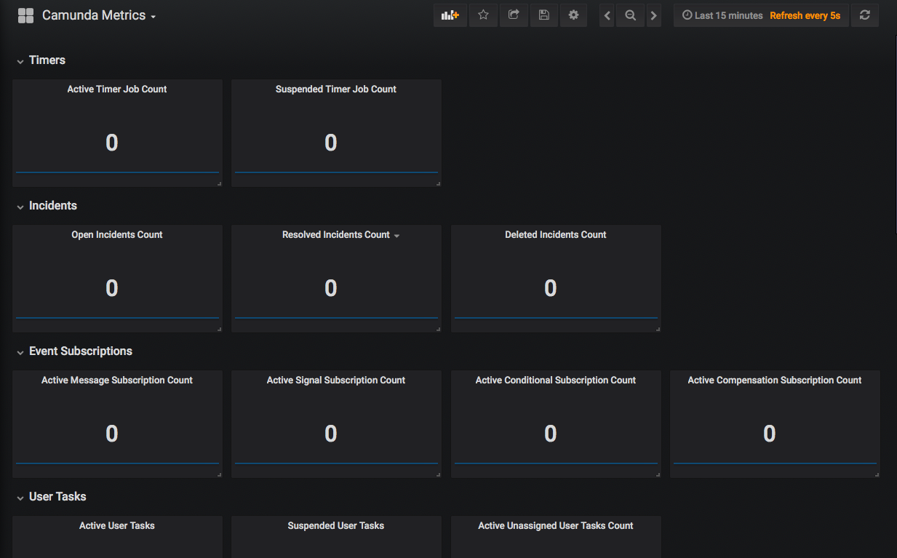
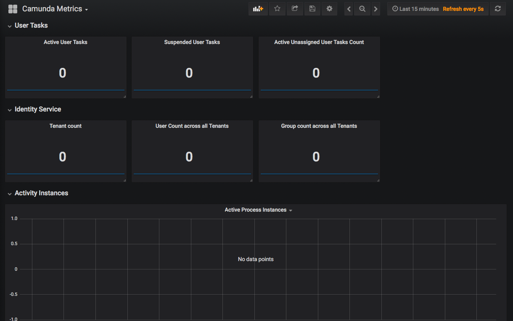

# Camunda BPM Prometheus Process Engine Plugin

Camunda Process Engine Plugin that implements a Prometheus Client HTTP Server, Collectors for the Camunda Metric 
system, and a Groovy based custom collector system allowing yml based configuration of custom collectors that are based on groovy scripts.


# How to Install Plugin into Camunda

1. Download Jar with Deps or Add this project as a dependecy into your build

2. Configure plugin through the camunda config xml.

3. Configure YML file for the metric collectors.

# Plugin Configuration

```xml
<!-- engine plugins -->
<property name="processEnginePlugins">
    <list>
        ...
            <bean id="prometheusPlugin" class="io.digitalstate.camunda.prometheus.PrometheusProcessMetricsProcessEnginePlugin">
                 <property name="port" value="9999" />
                 <property name="camundaReportingIntervalInSeconds" value="5"/>
                 <property name="collectorYmlFilePath" value="/camunda-prometheus/prometheus-metrics.yml"</property>
            </bean>
        ...
    </list>
</property>
```

The port is the port that the HTTP Server that Prometheus will use to access the metrics.


# Prometheus and Camunda Deployment/Setup:

1. Prometheus/Grafana Setup: `./docker/prometheus-grafana` : run `USERNAME=admin PASSWORD=admin docker-compose up`
1. Camunda 7.9.0 Setup: `./docker` : run `docker-compose up`

Prometheus will attempt to scape the Camunda metrics through the exposed endpoint from the plugin.

Make sure that Camunda and Prometheus are part of the same network / Prometheus is able to access the  metrics http endpoint being exposed on the Camunda server.

See the examples in the ./docker folder of this project.


# Default Grafana Configuration

A default Grafana dashboard with common queries is provided:

See folder: `./grafana/dashboards`

1. Current working template: `Camunda Metrics-1.json`


# YAML Collector Configuration

Each collector is configured through a single yaml file.  the Yaml file is set in the PLugins xml configuation such as:

```xml
<bean id="prometheusPlugin" class="io.digitalstate.camunda.prometheus.PrometheusProcessMetricsProcessEnginePlugin">
    ...
     <property name="collectorYmlFilePath" value="/camunda-prometheus/prometheus-metrics.yml"</property>
</bean>
```

## System Collectors

The System collectors use the following configuration

```yaml
system:
- collector: io.digitalstate.camunda.prometheus.collectors.camunda.BpmnExecution
  enable: true
  startDate: 2015-10-03T17:59:38+00:00
  endDate: now
  startDelay: 0
  frequency: 5000
```

Where:

1. `collector` (class name) is the fully qualified java class name of the collector.  The default Camunda metrics are implemented in the following classes: `io.digitalstate.camunda.prometheus.collectors.camunda.BpmnExecution`, `io.digitalstate.camunda.prometheus.collectors.camunda.DmnExecution`, `io.digitalstate.camunda.prometheus.collectors.camunda.JobExecutor`.
1. `enable` (boolean) allows you to enable and disable the collector.
1. `startDate` (ISO8601 String Date Format) start date that the metrics should be queried from using the Camunda metrics java api.
1. `endDate` (ISO8601 String Date Format, and special keyword  of `now`) end date that the metrics should be queried from using the Camunda metrics java api.  The end date allows the special keyword of `now` which tells the engine to always return the most recent data.
1. `startDelay` (long) the amount of time in milliseconds that the collector delay it self from starting on the first startup.  This is useful if you have other plugins or systems that you want to wait to finish starting before you execute the collector for the first time.
1. `frequency` (long) the amount of time in milliseconds between executions of the collector.


## Custom Collectors

The Custom collectors use the following configuration

```yaml
custom:
- collector: /customcollectors/UserTasks.groovy
  enable: true
  startDelay: 0
  frequency: 5000
```

Where:

1. `collector` (string, file path) is the file path to the groovy script file which will be used for collector execution.  The script is pre-compiled on timer creation; if changes are made to the groovy during runtime, the engine will need to be restarted for changes to come into effect.
1. `enable` (boolean) allows you to enable and disable the collector.
1. `startDelay` (long) the amount of time in milliseconds that the collector delay it self from starting on the first startup.  This is useful if you have other plugins or systems that you want to wait to finish starting before you execute the collector for the first time.
1. `frequency` (long) the amount of time in milliseconds between executions of the collector.
1. `config` (object/map) (:exclamation: **EXPERIMENTAL**) a key/value (`<String, Object>`) map for storing custom configurations to be used in the script execution.  Config can be accessed in the groovy script execution using the `config.getConfig()` method, where `config` is the CustomMetricsConfig.class which is being exposed to the script through bindings, and `.getConfig()` is returning the map in the `config` property of the collector.   


## Full Example

```yaml
# Camunda Prometheus Metrics configuration
# each object is a timer configuration
---
system:
- collector: io.digitalstate.camunda.prometheus.collectors.camunda.BpmnExecution
  enable: true
  startDate: 2015-10-03T17:59:38+00:00
  endDate: now
  startDelay: 0
  frequency: 5000
- collector: io.digitalstate.camunda.prometheus.collectors.camunda.DmnExecution
  enable: true
  startDate: 2015-10-03T17:59:38+00:00
  endDate: now
  startDelay: 0
  frequency: 5000
- collector: io.digitalstate.camunda.prometheus.collectors.camunda.JobExecutor
  enable: true
  startDate: 2015-10-03T17:59:38+00:00
  endDate: now
  startDelay: 0
  frequency: 5000

custom:
- collector: /customcollectors/UserTasks.groovy
  enable: true
  startDelay: 0
  frequency: 5000
- collector: /customcollectors/BpmnProcessDefinition.groovy
  enable: true
  startDelay: 0
  frequency: 5000
- collector: /customcollectors/EventsMetrics.groovy
  enable: true
  startDelay: 0
  frequency: 5000
- collector: /customcollectors/IdentityServiceMetrics.groovy
  enable: true
  startDelay: 0
  frequency: 5000
- collector: /customcollectors/IncidentMetrics.groovy
  enable: true
  startDelay: 0
  frequency: 5000
- collector: /customcollectors/ProcessInstances.groovy
  enable: true
  startDelay: 0
  frequency: 5000
- collector: /customcollectors/TimerMetrics.groovy
  enable: true
  startDelay: 0
  frequency: 5000
```


# Custom Metrics as Groovy Scripts

## Bindings (Variables exposed in the script)

The scripts execute without any class restrictions, and provide the following bindings for easy access:
1. `config` (package io.digitalstate.camunda.prometheus.config.yaml.CustomMetricsConfig) the CustomMetricsConfig object containing all data from the yaml config of the specific collector.
1. `processEngine` (org.camunda.bpm.engine.ProcessEngine) contains the process engine object allowing full access to process engine services.
1. `LOGGER` (org.slf4j.Logger) a logger to be specifically used by script executions.  Implemented as: `LoggerFactory.getLogger("CamundaCustomMetrics-ScriptLOGGER");`

# Performance considerations

Take into consideration the execution times of your metric collectors.  Each metric collector is 
run as a standalone timer thread execution, but the more collectors you add, and the large the 
data processing and/or database query time/load the collector uses per execution, it can create 
large performance impacts on the engine.


# Generic Metrics Classes

Simple but reusable metrics are provided for ease of use by BPMN process builders.

1. SimpleGaugeMetric (io.digitalstate.camunda.prometheus.collectors.SimpleGaugeMetric)
1. SimpleCounterMetric (io.digitalstate.camunda.prometheus.collectors.SimpleCounterMetric)
1. SimpleHistogramMetric (io.digitalstate.camunda.prometheus.collectors.SimpleHistorgramMetric)
1. SimpleSummaryMetric (io.digitalstate.camunda.prometheus.collectors.SimpleSummaryMetric)

See the Test folder for further usage, and see the metric classes.  They are generally simplifications over the existing metrics API.  They are designed to remove "extras" and simplify usage.

# Namspace

the `camunda` namespace is given to all metrics generated by the Simple Metric classes.

# Prometheus Collector Registry

The Default registry is used.

# Labels

Labels are supported and are generally implemented as a optional parameter in the method.  See examples above.


# Further screenshots





# Script examples for BPMN, DMN, CMMN execution: Creating and using Metric within the BPM execution
 
 **Groovy script Examples:**

```groovy
import io.digitalstate.camunda.prometheus.collectors.SimpleGaugeMetric;

def openCases = new SimpleGaugeMetric('open_cases', 'Number of Open Cases, labeled by Case Type', ['type'])

openCases.increment(['standard'])
```

```groovy
import io.digitalstate.camunda.prometheus.collectors.SimpleHistogramMetric

def httpRequest = new SimpleHistogramMetric('legacy_system_123_request', 'Connection duration time, labeled by HTTP Method', null, ['method'])

httpRequest.startTimer(['POST'])

sleep(Math.abs(new Random().nextInt() % 5000) + 650) // Simulates a delay

httpRequest.observeDuration()

```

```groovy
import io.digitalstate.camunda.prometheus.collectors.SimpleGaugeMetric

def money = new SimpleGaugeMetric('money_collected', 'dollar values collected, labeled by form of payment', ['payment_form'])

def amount = Math.abs(new Random().nextDouble() % 284.03) + 23.54 // Random dollar value
money.increment(amount, ['credit-card'])
```

```groovy
import io.digitalstate.camunda.prometheus.collectors.SimpleGaugeMetric

def openCases = new SimpleGaugeMetric('open_cases')

openCases.decrement(['standard'])

def closedCases = new SimpleGaugeMetric('closed_cases', 'Number of Open Cases, labeled by Case Type', ['type'])
closedCases.increment(['standard'])
```


# Default Metrics

Notes:

1. All default metrics are configured through the plugin properties of `pollingFrequencyMills` and `pollingStartDelayMills`.
1. All default metrics use a `engine_name` label which is used to identity the unique engine collecting the metrics.

There is two default metrics that are loaded:

## Camunda Engine Metrics (Default metric system/queries provided by Camunda):

All custom metrics as defined in the Camunda Metrics documentation are implemented:

LINK to Camunda Metrics Docs are located here.

Metric names follow the pattern of:

`metric_[metric name using underscores]`

Example:  Using the Camunda metric `activity-instance-start`, the metric would be created as 
`metric_activity_instance_start`, and would appear in Prometheus / Grafana as `camunda_metric_activity_instance_start`, 
where the `camunda_` is the namespace of the metric


# How to build the package

1. `./mvnw clean package`

# How to run tests

1. `./mvnw clean test`
