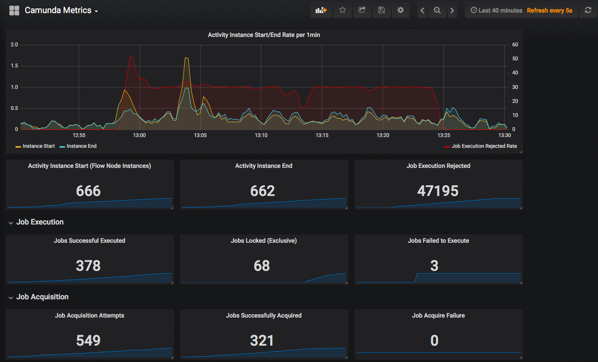

# Camunda BPM Prometheus Process Engine Plugin


Camunda Process Engine Plugin that implements a Prometheus Client HTTP Server, Collectors for the Camunda Metric 
system, and a Groovy based custom collector system allowing yml based configuration of custom collectors that are based on groovy scripts.


:exclamation: Still a work in progress, but fully functional.





# How to Install Plugin into Camunda

TODO: Add more details

1. Download Jar with Deps or Add Dep into your build

2. Configure plugin

3. Configure YML file


# Metrics Classes

Simple but reusable metrics are provided for ease of use by BPMN process builders.

1. SimpleGaugeMetric (io.digitalstate.camunda.prometheus.collectors.SimpleGaugeMetric)
1. SimpleCounterMetric (io.digitalstate.camunda.prometheus.collectors.SimpleCounterMetric)
1. SimpleHistogramMetric (io.digitalstate.camunda.prometheus.collectors.SimpleHistorgramMetric)
1. SimpleSummaryMetric (io.digitalstate.camunda.prometheus.collectors.SimpleSummaryMetric)

See the Test folder for further usage, and see the metric classes.  They are generally simplifications over the existing metrics API.  They are designed to remove "extras" and simplify usage.

# Namspace

the `camunda` namespace is given to all metrics generated by the Simple Metric classes.

# Prometheus Collector Registry

The Default registry is used.

# Labels

Labels are supported and are generally implemented as a optional parameter in the method.  See examples above.


# Plugin Configuration

```xml
<!-- engine plugins -->
<property name="processEnginePlugins">
    <list>
        ...
            <bean id="prometheusPlugin" class="io.digitalstate.camunda.prometheus.PrometheusProcessMetricsProcessEnginePlugin">
                 <property name="port" value="9999" />
                 <property name="camundaReportingIntervalInSeconds" value="5"/>
                 <property name="collectorYmlFilePath" value="/camunda-prometheus/prometheus-metrics.yml"</property>
            </bean>
        ...
    </list>
</property>
```

The port is the port that the HTTP Server that Prometheus will use to access the metrics.

# Default Metrics

Notes:

1. All default metrics are configured through the plugin properties of `pollingFrequencyMills` and `pollingStartDelayMills`.
1. All default metrics use a `engine_name` label which is used to identity the unique engine collecting the metrics.

There is two default metrics that are loaded:

## Camunda Engine Metrics (Default metric system/queries provided by Camunda):

All custom metrics as defined in the Camunda Metrics documentation are implemented:

LINK to Camunda Metrics Docs are located here.

Metric names follow the pattern of:

`metric_[metric name using underscores]`

Example:  Using the Camunda metric `activity-instance-start`, the metric would be created as 
`metric_activity_instance_start`, and would appear in Prometheus / Grafana as `camunda_metric_activity_instance_start`, 
where the `camunda_` is the namespace of the metric


# Prometheus Setup:

1. Prometheus/Grafana Setup: `./docker/prometheus-grafana` : run `USERNAME=admin PASSWORD=admin docker-compose up`
1. Camunda 7.9.0 Setup: `./docker` : run `docker-compose up`


# YAML Configuration

```yaml
# Camunda Prometheus Metrics configuration
# each object is a timer configuration
---
system:
- collector: io.digitalstate.camunda.prometheus.collectors.camunda.BpmnExecution
  enable: true
  startDate: 2015-10-03T17:59:38+00:00
  endDate: now
  startDelay: 0
  frequency: 5000
- collector: io.digitalstate.camunda.prometheus.collectors.camunda.DmnExecution
  enable: true
  startDate: 2015-10-03T17:59:38+00:00
  endDate: now
  startDelay: 0
  frequency: 5000
- collector: io.digitalstate.camunda.prometheus.collectors.camunda.JobExecutor
  enable: true
  startDate: 2015-10-03T17:59:38+00:00
  endDate: now
  startDelay: 0
  frequency: 5000

custom:
- collector: /customcollectors/UserTasks.groovy
  enable: true
  startDelay: 0
  frequency: 5000
- collector: /customcollectors/BpmnProcessDefinition.groovy
  enable: true
  startDelay: 0
  frequency: 5000
- collector: /customcollectors/EventsMetrics.groovy
  enable: true
  startDelay: 0
  frequency: 5000
- collector: /customcollectors/IdentityServiceMetrics.groovy
  enable: true
  startDelay: 0
  frequency: 5000
- collector: /customcollectors/IncidentMetrics.groovy
  enable: true
  startDelay: 0
  frequency: 5000
- collector: /customcollectors/ProcessInstances.groovy
  enable: true
  startDelay: 0
  frequency: 5000
- collector: /customcollectors/TimerMetrics.groovy
  enable: true
  startDelay: 0
  frequency: 5000
```

## System Metrics

## Custom Metrics


# Custom Metrics as Groovy Scripts

1. Bindings
1. Performance considerations


# Script examples for BPMN, DMN, CMMN execution: Creating and using Metric within the BPM execution
 
 **Groovy script Examples:**

```groovy
import io.digitalstate.camunda.prometheus.collectors.SimpleGaugeMetric;

def openCases = new SimpleGaugeMetric('open_cases', 'Number of Open Cases, labeled by Case Type', ['type'])

openCases.increment(['standard'])
```

```groovy
import io.digitalstate.camunda.prometheus.collectors.SimpleHistogramMetric

def httpRequest = new SimpleHistogramMetric('legacy_system_123_request', 'Connection duration time, labeled by HTTP Method', null, ['method'])

httpRequest.startTimer(['POST'])

sleep(Math.abs(new Random().nextInt() % 5000) + 650) // Simulates a delay

httpRequest.observeDuration()

```

```groovy
import io.digitalstate.camunda.prometheus.collectors.SimpleGaugeMetric

def money = new SimpleGaugeMetric('money_collected', 'dollar values collected, labeled by form of payment', ['payment_form'])

def amount = Math.abs(new Random().nextDouble() % 284.03) + 23.54 // Random dollar value
money.increment(amount, ['credit-card'])
```

```groovy
import io.digitalstate.camunda.prometheus.collectors.SimpleGaugeMetric

def openCases = new SimpleGaugeMetric('open_cases')

openCases.decrement(['standard'])

def closedCases = new SimpleGaugeMetric('closed_cases', 'Number of Open Cases, labeled by Case Type', ['type'])
closedCases.increment(['standard'])
```

# Default Grafana Configuration

A default Grafana dashboard with common queries is provided:

See folder: `./grafana/dashboards`

1. Current working template: `Camunda Metrics-1.json`


# Further screenshots


